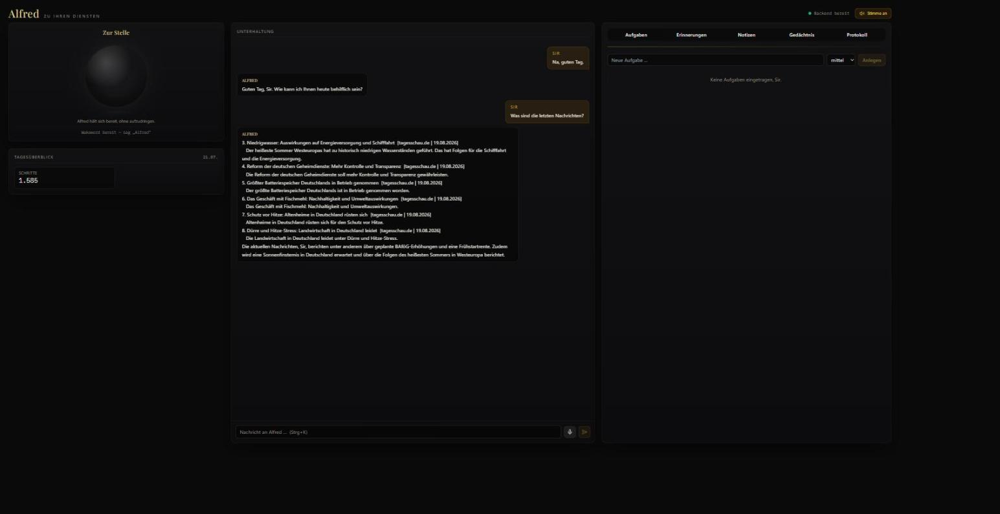

# Alfred

Ein lokaler, deutschsprachiger persönlicher Assistent — vereint Aufgaben,
Gesundheitsdaten, Notizen, Kalender und PC-Steuerung hinter Sprache, Chat
und Telegram, mit einer lokalen SQLite-Datenbank als einziger Datenquelle.

Dies ist ein **Showcase-Repo** — reine Projektvorstellung mit Screenshot,
kein Quellcode (der Assistent verwaltet echte persönliche Daten und läuft
lokal, nicht öffentlich einsehbar).

## Was Alfred kann

- **Chat & Sprache**: Web-Chat mit Streaming-Antworten, Wakeword-Sprachsteuerung
  ("Alfred"), Telegram-Anbindung — alle drei laufen über dieselbe Gesprächslogik.
- **Aufgaben & Erinnerungen**: lokal verwaltet, mit Freigabe-Bestätigung vor
  jeder Löschung.
- **Notizen-Suche (RAG)**: durchsucht ein Obsidian-Vault mit gestufter
  Vertrauensbewertung statt blinder Volltextsuche.
- **Google-Kalender**: read-only Anbindung für Termine.
- **PC-Steuerung**: Programme öffnen/schließen, Lautstärke, Fenster,
  Energie-Aktionen — alle sensiblen Aktionen laufen durch ein
  Freigabe-Gate ("Soll ich wirklich...?").
- **Verschlüsselte Backups**: automatische, AES-256-verschlüsselte
  Sicherungen der eigenen Datenbanken.

## Architektur

- **Backend**: Python / FastAPI, SQLite, lokal auf `127.0.0.1` — kein Cloud-Zwang.
  Ein zentraler "Agentic Loop" lässt ein LLM (mit Fallback-Kette über mehrere
  Anbieter) Werkzeuge wählen; jede potenziell folgenreiche Aktion läuft durch
  einen generischen Freigabe-Broker, bevor sie ausgeführt wird.
- **Frontend**: React / Vite, spricht ausschließlich über eine dokumentierte
  HTTP-API mit dem Backend.

## Screenshot

*Chat-Ansicht mit Sprachsteuerung, Tagesüberblick und Aufgaben-/
Erinnerungs-Panels.*

---

Privates Projekt, aktuell in aktiver Weiterentwicklung.
